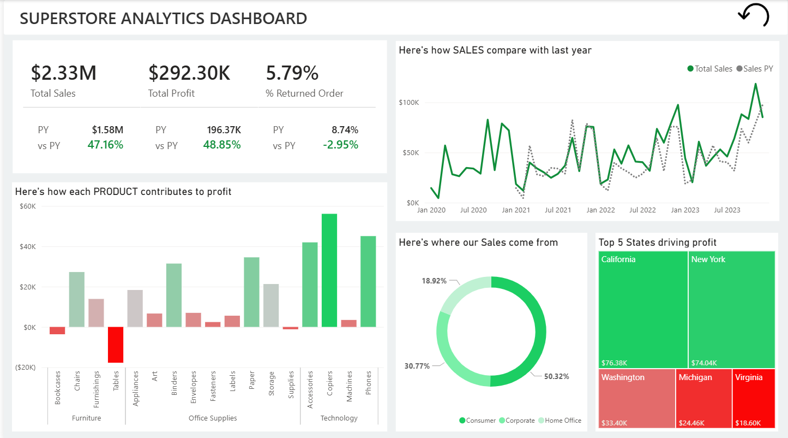

# Superstore Sales Analysis

## Overview

This project presents an interactive sales analysis dashboard built using Microsoft Power BI.

The analysis uses Superstore sales data to explore overall sales and profit performance, year-over-year comparison, product contribution to profit, customer segment performance, and state-level profitability.

The project focuses on presenting business metrics and trends through an interactive Power BI dashboard.

## Objectives

- Analyze overall sales and profit performance
- Compare current performance with the previous year
- Understand product-level contribution to profit
- Analyze sales contribution by customer segment
- Identify states contributing the most to profit
- Monitor returned orders
- Present the analysis through an interactive dashboard

## Tools & Technologies

- **Microsoft Excel** – Data source
- **Microsoft Power BI** – Data analysis and visualization
- **Power BI Dashboard** – Interactive reporting

## Dataset

The project uses Superstore sales data containing information related to sales, profit, products, customers, orders, returns, and geographical performance.

The source Excel file is available in the `data` folder.

## Dashboard



## Dashboard Overview

The dashboard provides a high-level view of business performance through several sections.

### Key Performance Indicators

The dashboard displays:

- Total Sales
- Total Profit
- Percentage of Returned Orders
- Previous Year Sales
- Previous Year Profit
- Previous Year Returned Order Rate
- Year-over-Year performance comparison

### Sales Performance

The sales trend compares current sales with previous-year sales over time.

This helps provide a view of how sales performance changes across the reporting period.

### Product Profitability

The product analysis shows how different products contribute to overall profit.

The visualization helps identify products with stronger and weaker profit contribution.

### Customer Segment Contribution

Sales are analyzed across:

- Consumer
- Corporate
- Home Office

This provides a view of how different customer segments contribute to sales.

### State-Level Profitability

The dashboard highlights the top states contributing to profit, helping identify stronger-performing geographical markets.

## Dashboard Highlights

The dashboard currently reports:

- **Total Sales:** $2.33M
- **Total Profit:** $292.30K
- **Returned Order Rate:** 5.79%
- **Sales vs Previous Year:** +47.16%
- **Profit vs Previous Year:** +48.85%
- **Returned Order Rate vs Previous Year:** -2.95%

The dashboard also shows:

- Consumer as the largest sales-contributing customer segment
- Copiers as one of the strongest contributors to profit
- Tables showing a negative profit contribution in the product analysis
- California and New York among the top states by profit

## Analysis Performed

The project explores:

- Sales performance
- Profitability
- Year-over-year comparison
- Product-level profit contribution
- Customer segment contribution
- State-level profit performance
- Returned order rate

## Project Structure

```text
superstore-sales-analysis/
│
├── README.md
│
├── data/
│   └── Superstore.xlsx
│
├── powerbi/
│   └── Superstore_Analysis_Dashboard.pbix
│
└── screenshots/
    └── dashboard.png
    └── slicer panel.png
